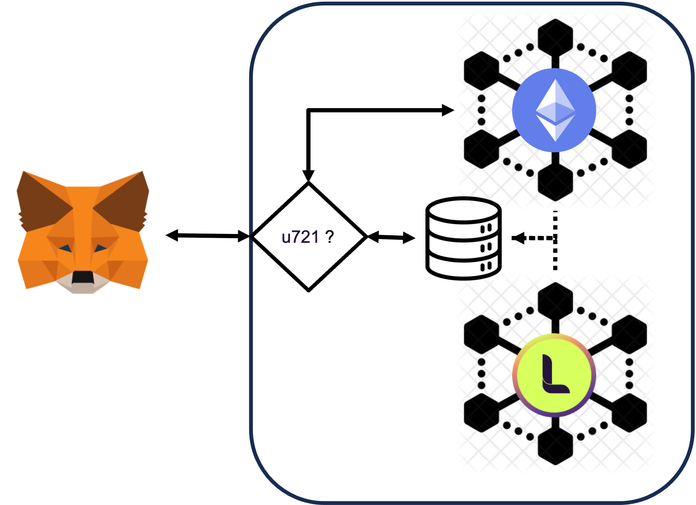

# This repository has been archived

 Please note that this repository has been archived and is no longer actively maintained. Please refer to the main [LAOS repository](https://github.com/freeverseio/laos) to keep up to date with the development of the LAOS Network. 

# **LAOS Roadmap**

The LAOS Parachain aims to provide a bridgelessly-connected, secure, decentralized, and highly scalable platform for creating, owning, and evolving unique digital assets across all blockchains. In its final form, from a high-level technical perspective, the platform will consist of a main Parachain $(b)$ that manages the asset ownership (the **OwnChain**), the native coin, and governance, etc., connected via a trustless bridge $(c)$ to a LAOS Relay Chain $(d)$ to which **EvoChains** are connected via Parachain patterns. Evochains ($e_i$) manage the minting and evolution of the assets' attributes.

On a first step towards the full architecture, the OwnChain and EvoChains' functionality will reside in the Parachain. In this MVP, bridgeless minting and evolution will be possible on all EVM chains, as detailed in the [LAOS Whitepaper](https://github.com/freeverseio/laos-whitepaper/blob/main/laos.pdf). This is depicted in the following figure.

In subsequent steps, the LAOS Relay Chain will be spawned, connected via the trustless bridge, with its native currency based on transferred LAOS tokens, and its governance controlled by the Parachain.

In the final step, Evochains will be spawned from the LAOS Relay Chain, increasing their number as usage requires.

The platform will utilize the Substrate framework and expose EVM compatibility, leveraging work by other Parachains, such as Moonbeam.
In addition, the LAOS Parachain will implement a governance system that will enable token holders to propose and vote on changes to the protocol.

---
## Milestone 1 [months 0-3]

The first milestone of the project aims to establish the basic infrastructure required for the development of 
the LAOS blockchain network within the subsequent three months. The primary goals are to create the LAOS ownership 
chain (**OwnChain**) as a parachain of Rococo, and create the first LAOS evolution chain (**EvoChain**). A bi-directional trustless bridge will 
be installed to enable cross chain communication, allowing the ownership chain to govern the evolution chain.

At the end of this milestone, we shall have released:
- LAOS ownership chain node
- LAOS evolution chain node
- LAOS bidirectional bridge

The following are the 3 main deliverables of Milestone 1.

### Deliverable 1: 
The primary objective of the first deliverable is to bootstrap the project by creating and automating a test 
infrastructure focused on local testing, continuous integration, and continuous delivery. The goal is to 
establish the fundamental infrastructure upon which we will build the project's subsequent deliverables. 
To achieve this goal, we will release the LAOS ownership parachain node and the LAOS evolution chain node. 
After completion of this deliverable, the LAOS ownership chain will be operational and connected to 
Rococo as a parachain, and the first EvoChain will be up and running as a solochain.

- [OwnChain] release of LAOS ownership parachain node based on the [substrate parachain template](https://github.com/substrate-developer-hub/substrate-parachain-template)
- [OwnChain] LAOS ownership chain is alive
- [OwnChain] LAOS ownership chain connected as a parachain to a test relay chain
- [EvoChain] release of LAOS evolution chain node based on the [substrate node template](https://github.com/substrate-developer-hub/substrate-node-template)
- [EvoChain] LAOS evolution chain is alive 

### Deliverable 2: 
The second deliverable is focused entirely on creating a trustless bridge between the LAOS evolution chains
and the ownership chain. To achieve this, we will install an evolution chain light client in the ownership 
chain and initiate a bridge service between the two chains. In future deliverables, the bridge will be used to
open the Grandpa-XCM channel from the evolution chain to the ownership chain.

- [OwnChain] integrate the [solochain-parachain bridge](https://github.com/paritytech/solo-para-bridge-poc)
- [bridge] release of LAOS bridge
- [bridge] evolution -> ownership bridge up and running

### Deliverable 3: 
The third deliverable will focus on enabling bidirectional communication of the LAOS chain through trustless 
bridges, this will eventually allow aspects of the EvoChains to be triggered by the OwnChain, such as runtime updates,
or transfer of native LAOS tokens. 

- [EvoChain] integrate the [solochain-parachain bridge](https://github.com/paritytech/solo-para-bridge-poc)
- [EvoChain] governance removed
- [OwnChain] capable of sending commands via XCM
- [bridge] ownership -> evolution bridge up and running

---
## Milestone 2 [months 3-6]

Milestone 2 will yield the first runtime, prepared for deployment on the Kusama mainnet. Additionally, it will focus on winning an auction in Kusama and launching K-LAOS (Kusama-LAOS).

After acquiring a full understanding of how to set up the bridge and the corresponding light-clients from Milestone 1, the EvoChain will temporarily be fused into the OwnChain, 
in order to be ready to go to mainnet with the first step of the architecture described above. 

During Milestone 2 we will also concentrate on implementing one core feature of LAOS Assets: enabling bridgeless minting and evolution in all EVM chains (including Ethereum and Polygon).
This will require work on three fronts.

On the one hand, we will work on the pallet to enable creating collections, minting, and evolving the assets' metadata. We will also work on extending the ERC721 standard to enable bridgeless minting, and provide Solidity reference implementations. Finally, we will produce the first version of the LAOS Universal Node, capable of permissionlessly syncing with assets whose ownership and attributes are managed by two different consensus systems.

At the end of this milestone, we shall have released:
- stable release of the LAOS Runtime deployed on a Parachain in Kusama,
- stable release of the LAOS Universal node,
- stable release of the Universal extension for bridgeless minting, including spec and Solidity code.

The following are the 3 main deliverables of Milestone 2.

### Deliverable 1:
This deliverable will focus on the business logic for creating collections and managing their evolution, in manners that can be used by any EVM-compatible ownership chain to benefit from bridgeless minting and evolution.

We will develop a **LAOS evolution pallet** and integrate it, first in the EvoChain, and then fuse it into the OwnChain. This will allow the creation and evolution of collections.

- [EvoChain] & [OwnChain] development and stable release of the LAOS evolution pallet

### Deliverable 2:
This deliverable will focus on developing the necessary services to ensure compatibility with the ERC721 standard. This will involve introducing the [LAOS Universal node](https://github.com/freeverseio/laos-universal-node), which will provide an Ethereum JSON-RPC API. As a result, Ethereum wallets such as Metamask, as well as any DApp already familiar with EVM-compatible blockchains, will be able to interact with LAOS Assets. [This issue](https://github.com/freeverseio/laos-erc721/issues/11) is aimed at completing the specification for the Universal Node.

Likewise, parallel work will be done to define the specs for the smart contracts that will extend the standard ERC721 interface, namely, to a ERC721 Universal standard, capable of using bridgeless minting and evolution on any EVM-compatible blockchain.

- [uNode] stable release of Universal Node 
- [uNode] stable release of Universal extension for bridgeless minting, including spec and Solidity code.

### Deliverable 3:
In an effort to closely mirror the environment of Polkadot's final Parachain, we plan to bid for an auction in Kusama and deploy K-LAOS (Kusama LAOS). This approach will challenge the project to tackle that crucial last 10% of the work, which often accounts for 90% of the effort. It will also encourage a development cycle focused on producing minimal, yet incrementally valuable, fully tested updates. These updates will first be vetted on the FV-Rococo chain before being deemed ready for the mainnet.

- [K-LAOS] K-LAOS produces blocks as a Parachain in Kusama
- [infrastructure] Collators in at least three different cloud providers
- [infrastructure] Fully functioning EVM explorer 

---

## Milestone 3 [months 6-9]

Milestone 3 will start with the deployment on Kusama, after acquiring a slot.
We will incrementally add features to the deployed MVP.

On the one hand, we will prioritize cross-chain transfers of both LAOS coins (via XC-20) and LAOS ERC721
tokens, especially to smart contract chains like Moonbeam and Astar. 
We will also finalize the Ownership chain pallet for managing ownership
in the LAOS Parachain (as opposed to external EVM chains), by completing 
the core business logic from Milestone 1, and complementing it with the [nfts pallet](https://github.com/paritytech/substrate/tree/master/frame/nfts),
producing a fully ERC721-compatible **LAOS ownership pallet**.

Finally, we will also create a LAOS assets marketplace to demonstrate the system's capabilities, including bridgeless minting and evolution. We will also transition from sudo to a more decentralized governance system. 

At the end of this milestone, we shall have released:
- XC-20 and XC-721 transfers,
- stable release of the LAOS Ownership pallet,
- LivingAssets market.

The following are the 3 main deliverables of Milestone 3.

### Deliverable 1:
We will implement the XC-20 transfers and XCMv3 primitives to control LAOS Assets from sibling parachains.

- [OwnChain] remote transfer of LAOS coins
- [OwnChain] remote transfer of LAOS Assets

### Deliverable 2:
- [Frontend] creation of LAOS Assets marketplace based on the [substrate frontend template](https://github.com/substrate-developer-hub/substrate-front-end-template)

### Deliverable 3:

We will extend the core business logic from Milestone 1, and complement it with the [nfts pallet](https://github.com/paritytech/substrate/tree/master/frame/nfts),
to produce a fully ERC721-compatible **LAOS ownership pallet**.

- [OwnChain] stable release of the LAOS Ownership pallet,

## Notes

- The LAOS team follows the Scrum methodology, conducting sprint cycles lasting two weeks. Regular updates on sprint progress can be shared with the Substrate Builders Program team during sprint review meetings.
  
- All software developed as part of the LAOS Parachain project will be released as open-source under an appropriate license.
