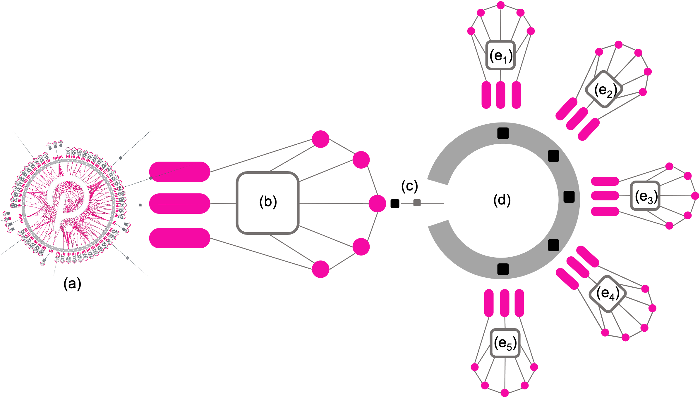
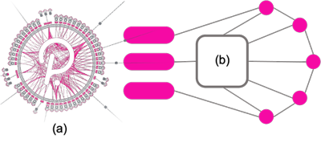
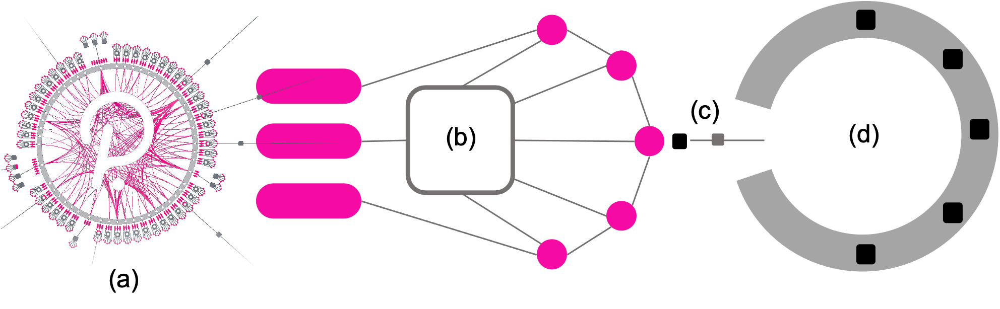

# **LAOS Roadmap**

The LAOS Parachain aims to provide a bridgelessly-connected, secure, decentralized and highly scalable platform for the creation, ownership, and evolution of unique digital assets across all blockchains. In its final form, from a high-level technical perspective, the platform will consist of a main Parachain $(b)$ that manages the ownership of the assets (the **OwnChain**), the native coin, and governance, etc., connected via a trustless bridge $(c)$ to a LAOS Relay Chain $(d)$ to which **evoChains** are connected via Parachain patterns. Evochains ($e_i$) manage the minting and evolution of the assets' attributes.

On a first step towards the full architecture, all functionality of both the OwnChain and the EvoChains will lie in the Parachain. In this MVP, bridgeless minting and evolution will be possible in all EVM chains, as described in the [LAOS Whitepaper](https://github.com/freeverseio/laos-whitepaper/blob/main/laos.pdf). This is depicted in the following figure.

In subsequent steps, the LAOS Relay Chain will be spawn, connected via the trustless bridge, with its native currency based on transferred LAOS tokens, and its governance controlled by the Parachain.

In the final step, Evochains will be spawn from the LAOS Relay Chain, increasing their number as usage requires.

The platform will utilize the Substrate framework and expose EVM compatibility, leveraging work by other Parachains, such as Moonbeam.
In addition, the LAOS Parachain will implement a governance system that will enable token holders to propose and vote on changes to the protocol.

---
## Milestone 1 [months 0-3]

The first milestone of the project aims to establish the basic infrastructure required for the development of 
the LAOS blockchain network within the subsequent three months. The primary goals are to create the LAOS ownership 
chain (**OwnChain**) as a parachain of Rococo, and create the first LAOS evolution chain (**EvoChain**).A bi-directional trustless bridge will 
be installed to enable cross chain communication, allowing the ownership chain to govern the evolution chain.

At the end of this milestone, we shall have released:
- LAOS ownership chain node
- LAOS evolution chain node
- LAOS bidirectional bridge

The following are the 3 main deliverables of Milestone 1.

### Deliverable 1: 
The primary objective of the first deliverable is to bootstrap the project by creating and automating a test 
infrastructure focused on local testing, continuous integration, and continuous delivery. The goal is to 
establish the fundamental infrastructure upon which we will build the project's subsequent deliverables. 
To achieve this goal, we will release the LAOS ownership parachain node and the LAOS evolution chain node. 
After completion of this deliverable, the LAOS ownership chain will be operational and connected to 
Rococo as a parachain, and the first EvoChain will be up and running as a solochain.

- [OwnChain] release of LAOS ownership parachain node based on [substrate parachain template](https://github.com/substrate-developer-hub/substrate-parachain-template)
- [OwnChain] LAOS ownership chain is alive
- [OwnChain] LAOS ownership chain connected as a parachain to a test relay chain
- [EvoChain] release of LAOS evolution chain node based on the [substrate node template](https://github.com/substrate-developer-hub/substrate-node-template)
- [EvoChain] LAOS evolution chain is alive 

### Deliverable 2: 
The second deliverable is focused entirely on creating a trustless bridge between the LAOS evolution chains
and the ownership chain. To achieve this, we will install an evolution chain light client in the ownership 
chain and initiate a bridge service between the two chains. In future deliverables, the bridge will be used to
open the Grandpa-XCM channel from the evolution chain to the ownership chain.

- [OwnChain] integrate the [solochain-parachain bridge](https://github.com/paritytech/solo-para-bridge-poc)
- [bridge] release of LAOS bridge
- [bridge] evolution -> ownership bridge up and running

### Deliverable 3: 
The third deliverable will focus on enabling bidirectional communication of the LAOS chain through trustless 
bridges, this will eventually allow aspects of the evoChains to be triggered by the OwnChain, such as runtime updates,
or transfer of native LAOS tokens. 

- [EvoChain] integrate the [solochain-parachain bridge](https://github.com/paritytech/solo-para-bridge-poc)
- [EvoChain] governance removed
- [OwnChain] capable of sending commands via XCM
- [bridge] ownership -> evolution bridge up and running

---
## Milestone 2 [months 3-6]

Milestone 2 will produce the first runtime ready to deploy on Kusama mainnet. After having acquired a full understanding about how to set up the bridge and the corresponding light-clients from Milestone 1, the EvoChain will be fused into the OwnChain temporarily, 
in order to be ready to go to mainnet with the first step of the architecture described above. 

During Milestone 2 we will also concentrate on implementing one core feature of LAOS Assets: enabling bridgeless minting and evolution in all EVM chains (including Ethereum and Polygon).
This will require work on three fronts.

On the one hand we will work on the pallet to enable creating collections, minting and evolving the assets' metadata. We will also work on extending the ERC721 standard to enable bridgeless minting, and provide Solidity reference implementations. Finally, we will produce the first version of the LAOS Universal Node, capable of permissionlessly syncing with assets whose ownership and attributes are managed by two different consensus systems.

At the end of this milestone, we shall have released:
- The MVP for the LAOS Runtime ready for mainnet,
- The MVP for the LAOS Universal node,
- THe ERC721 Universal extension for bridgeless minting, including spec and Solidity code.

The following are the 3 main deliverables of Milestone 2.

### Deliverable 1:
This deliverable will focus on the business logic for creating collections and managing their evolution, in manners that can be verifiable from the ownership chain.

To achieve this, we will develop a **LAOS ownership pallet** based on the [nfts pallet](https://github.com/paritytech/substrate/tree/master/frame/nfts) and integrate it into the ownership chain. Additionally, we will develop a **LAOS evolution pallet** and integrate it into the evolution chain. This will allow the creation and evolution of collections.

- development of LAOS ownership pallet based on [nfts pallet](https://github.com/paritytech/substrate/tree/master/frame/nfts) 
- [OwnChain] integration LAOS ownership pallet  
- development of LAOS evolution pallet
- [EvoChain] integration of LAOS evolution pallet

### Deliverable 2:
This deliverable will focus on the development of the necessary services to provide compatibility with the ERC721 standard. This will involve introducing the [LAOS ERC721 node](./erc721Capabilities/README.md), which will provide an Ethereum JSON-RPC API. As a result, Ethereum wallets such as Metamask, as well as ayn DApp already familiarized with EVM-compatible blockchains, will be able to interact with LAOS Assets.

- release ERC721 node 

### Deliverable 3:
In order to open the economy of the LAOS token we will implement XC-20 protocol for reserve transfer. The protocol will not only allow the transfer of LAOS tokens
from the ownership chain to other parachains, but also between the ownership chain and the evoChains; eventually, the evoChains will not own any native token,
and will resort to LAOS tokens transferred by the bridge to function. 

- [OwnChain] XC-20 protocol, with transfers from ownership chain to evoChains and to other sibling parachains

---

## Milestone 3 [months 6-9]

During the final stage of development, we will prioritize cross-chain communication with sibling parachains, conduct a thorough code audit, and make preparations for the stable release of the code. We will also create a dynamic asset marketplace to demonstrate the system's capabilities. Finally, we will enable staking and transition from sudo to a more decentralized governance system. 

At the end of this milestone, we shall have released:
- LivingAssets market

The following are the 3 main deliverables of Milestone 3.

### Deliverable 1:
We will extend the XC-20 transfers with XCMv3 primitives to control LAOS Assets from sibling parachains.

- [OwnChain] remote transfer of LAOS Assets

### Deliverable 2:
- [frontend] creation of LAOS Assets marketplace based on [substrate frontend template](https://github.com/substrate-developer-hub/substrate-front-end-template)
- [OwnChain] staking enabled
- code audit

### Deliverable 3:
In the final deliverable we will release the first stable version of the software and remove the sudo pallet from the ownership chain.
Depending on maturity of different components in the ecosystem, this milestone may also include the governance / runtime changes of the evoChains to be triggered 
from the ownership chain.

- [OwnChain] remove sudo pallet
- stable release of LAOS ownership node
- stable release of LAOS evolution node
- stable release of ERC721 node
- stable release of the bridge

### Deliverable 4:
This deliverable will focus on the generation of proofs of existence for the metadata of the assets evolved in evoChains. Anyone with access to EvoChain data will be able to generate such proofs and verify them on-chain in the ownership chain.

- [EvoChain] generate proof of existence of assets metadata
- [OwnChain] verify proof of existence of assets metadata

---

## Notes

- The LAOS team follows the Scrum methodology, conducting sprint cycles lasting two weeks. Regular updates on sprint progress can be shared with the Substrate Builders Program team during sprint review meetings.
  
- All software developed as part of the LAOS Parachain project will be released as open-source under an appropriate license.
