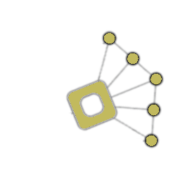

## LAOS Roadmap

### Goals and Objectives

The LAOS Parachain aims to provide a secure and decentralized platform for the creation, ownership, and evolution of unique digital assets. The platform will utilize the Substrate framework and enable users to easily mint, trade, and evolve their assets. In addition, the LAOS Parachain will implement a robust governance system that will enable token holders to propose and vote on changes to the protocol.
### Milestone 1 [0-3 months]

The focus of this milestone is to develop the LAOS ownership chain as a parachain, using the AURA protocol for block production. We will implement the business logic for creating collections and changing asset ownership, while establishing the necessary infrastructure for continuous integration/continuous deployment (CI/CD) and testing network. To ensure the reliability and functionality of the LAOS parachain, we will connect a testing network to the Rococo relay chain for further testing and development.

#### **Deliverable 1**: 

- release of LAOS ownership parachain node
    - LAOS token
    - PoA
    - CI / CD
- LAOS ownership network is alive

#### **Deliverable 2**: 

- LAOS ownership chain connected to Rococo as a parachain
- release of the evolution chain node:
    - no economy
    - PoA
    - CI / CD
- LAOS evolution chain is alive

#### **Deliverable 3**: 
- creation of collections on ownership chain
- trasfer of assets
- [evoChain] creation of collection
- [evoChain] evolution of the assets metadata by collection's owner

### Milestone 2 [3-6 months]
The main objective of this milestone is to develop the LAOS Evolution Chain (EVOChain) node and integrate it with the existing Ownership Chain using a trustless bridge, thus creating the first LAOS evolution chain.

To achieve this goal, we will focus on implementing the necessary business logic to support asset evolution. By the end of this milestone, our aim is to have a fully functional and secure LAOS evolution chain integrated with the LAOS parachain in ROCOCO, which will allow for seamless asset evolution.

* **Deliverable 4**:
* **Deliverable 5**:
* **Deliverable 6**:

### Milestone 3 [6-9 months]
This milestone aims to integrate the LAOS parachain with the ROCOCO relay chain. The XC-20 protocol will be integrated to facilitate transfer of the LAOS token to sibling parachains. Publication of the whitepaper.

* **Deliverable 7**:
* **Deliverable 8**:
* **Deliverable 9**:

### Notes

- The LAOS team follows Scrum methodology, conducting sprint cycles lasting two weeks. Regular updates on sprint progress are shared with the Substrate Builders Program team during sprint review meetings.
- The Substrate Builders Program team is invited to participate in these meetings to offer feedback and guidance on project development.
- A new release of the LAOS Parachain will be proposed at the end of each sprint, subject to stakeholder approval. 
- All software developed as part of the LAOS Parachain project will be released as open-source under an appropriate license.